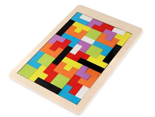
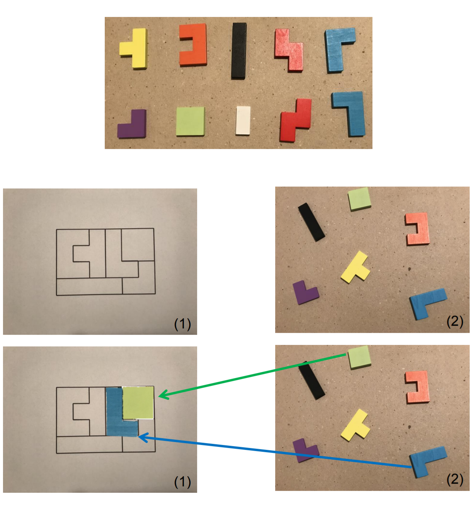
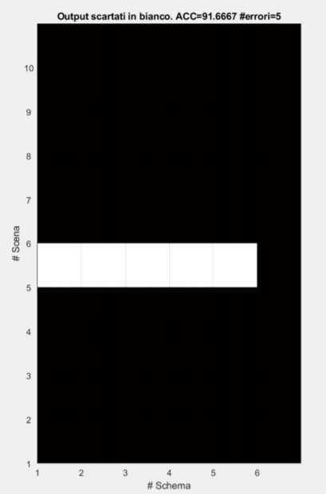

[tr_background]: docs/sfondo.jpg "Background class training"
[tr_tetramini]: docs/tetramini.jpg "Tetramini class training"

[sauvola]: https://it.mathworks.com/matlabcentral/fileexchange/40266-sauvola-local-image-thresholding "Sauvola implementation"
[labeling_schematic]: docs/schematic_labeling.png "Schematic labeling process"

[labeling_scene]: docs/scene_labeling.png "Scene labeling process"

[place_combination]: docs/place_combination.png "6 schematic tetramini and 11 scene tetramini"
[place_matrix]: docs/place_matrix.png "Matrix of correlation values"
[place_final]: docs/place_final.png "The placement of a tetramino"

[results_issue]: docs/results_issue.png "Binarization error"
[results_01_09]: docs/results_01_09.png "Results of Schematic #01 and Scene #09"
[results_02_02]: docs/results_02_02.png "Results of Schematic #02 and Scene #02"
[results_03_07]: docs/results_03_07.png "Results of Schematic #03 and Scene #07"
[results_04_06]: docs/results_04_06.png "Results of Schematic #04 and Scene #06"


# Tetramini

<div align="center">
  
</div>

An image processing program for solving Tetris Puzzles.  

In a Tetris Puzzle, there are several figures (we call them *Tetramini*, plural for *Tetramino*) that, combined together, must compose a pattern without holes.  

## Functionality

Given two input images (named scene and schematic) and assuming a set of available tetramini,
the program outputs an image showing how the tetramini detected in the scene were placed within the schematic.

The **schematic image (1)** represents a pattern where to place the tetramini, whereas the **scene image (2)** contains tetramini scattered on a flat surface.

<div align="center">
  
</div>

## Assumptions

The program does not process images in the wild. For proper execution, it should be assumed that the input images are shot in the same manner as the examples shown previously:
- Images must be shot from above, perpendicular to the support plane, with uniform lighting and without noise
- The background texture, shooting distance, and color balance of scene images must be the same as that of training images
- Tetramini in the scene must have a color that is homogeneous and featured in the tetramini of the training image
- The schematic pattern must be at the center of the schematic image
- There must be no extraneous objects in the images
- Input images must be the same size as the training images


Important things to note:
- Tetramini in the scene can be translated and rotated to be placed in the schematic, but cannot be mirrored
- Only the images in the `Training` folder can be used for eventual training of classifiers
- The scene image may contain a different number of tetramini than the schematic image


## Project

The project was developed for the *Elaborazione delle Immagini 2020/2021* class of University of Milano-Bicocca by: Pozzi Michele, Pretell Kevin, Manganaro Francesco, Gargaro David.

#### Project Structure

```
project
│   README.md               This file
│   sfondo.jpg              Background class training
│   tetramini.jpg           Tetramini class training
│  
│   main.m                  Executes the program
│   main_batch.m            Executes the program testing
│   quality_control.m       Executes the quality control
│  
│   class_knn.m             Trains the classifier
│   etichetta_schema.m      Labels the schematic image
│   etichetta_scena.m       Labels the scene image
│   piazza_tetramino.m      Manages the Tetramini placing
│  
│   calcola_angolo.m        Returns best rotating angle by correlation
│   clicksubplot.m          Quality control clicks management
│   crop_regione.m          Crop the region-of-interest of a mask
│   sauvola.m               Sauvola's local thresholding implementation
│   ...
│
└───Scene                   Scene images
│   │   P01.jpg
│   │   P02.jpg
│   │   ...
│
└───Schemi                  Schematic images
│   │   S01.jpg
│   │   S02.jpg
│   │   ...
│
└───Training                Training images
│   │   R01.jpg
│   │   R02.jpg
│   
└───docs                    Documentation images
    │   ...
```


## Algorithm

The algorithm can be divided into four sections:
1. Classifier training
1. Schematic labeling
1. Scene labeling
1. Tetramini placing

#### Classifier training

The program solves a binary classification problem: tetramino vs background. An image for each class has been created by manually segmenting regions from the training images.  

Background class training
![Background class training image][tr_background]

Tetramini class training
![Tetramini class training image][tr_tetramini]

A KNN classifier with 3 neighbors is trained and will later be used to label the scene image.


#### Schematic labeling

The image is read as a gray image and binarized using [an implementation of Sauvola's local image thresholding][sauvola].  
A median filter is then applied and the image is finally labeled using a connected-component labeling algorithm.  
The resulting image will have a different label for each distinct region.

![Schematic labeling process][labeling_schematic]


#### Scene labeling

A mean filter is applied to the scene image to smooth the tetramini and background colors.  

Afterwards, the KNN classifier is used to predict the binary classes.  
The resulting binary mask will present some superfluous small areas (e.g. shadows) that are removed by an application of morphological opening followed by the removal of small regions from the image.  

Finally, the image is labeled using a connected-component labeling algorithm.  
The resulting image will have a different label for each distinct region.

![Scene labeling process][labeling_scene]


#### Tetramini placing

Each tetramino in the labeled schematic image is considered individually and the correlation between it and every tetramino in the labeled scene image is computed as explained in the following.  

Each tetramino in the scene is rotated using multiple angles to consider every configuration it can assume, and the Pearson correlation coefficient between it and the schematic tetramino is measured each time.  
The angle representing the best correlation coefficient is saved along with the correlation value.  

![6 schematic tetramini and 11 scene tetramini][place_combination]

The angle and correlation values are placed along the dimensions of a matrix representing tetramini in schematic versus tetramini in scene.  
Global maximas of the correlation values higher than a fixed threshold are extracted from the matrix, and each time the corresponding row and column are deleted.  
The extracted values give information on the best (schematic, scene) tetramini pairs and the angles needed for proper placement into the the schematic.

![Global maxima are extracted from the matrix of correlation values][place_matrix]

For each pair, these information are used to place the scene tetramino into the original schematic image by first emptying the corresponding region and then positioning the correctly rotated tetramino. 

![The placement of a tetramino][place_final]


## Results

The algorithm provided an accuracy of **91.66%**.  
All the errors arise from Scene image #05 due to a binarization error of the black tetramino. In fact, it features a tricky lighting that distances its color too much from the training samples.  

![Binarization error][results_issue]

Accuracy is measured in a supervised manner thanks to a script that displays the combinations between each scene image and all the schematic image and allows errors to be reported by clicking the faulty combinations.

<div align="center">
  
</div>

The program produces the output with an average execution time of **8 seconds**, measured on a i7-4770k processor.  


#### Results examples

Schematic #01 - Scene #09  
![Results of Schematic #01 and Scene #09][results_01_09]

Schematic #02 - Scene #02  
![Results of Schematic #02 and Scene #02][results_02_02]

Schematic #03 - Scene #07  
![Results of Schematic #03 and Scene #07][results_03_07]

Schematic #04 - Scene #06  
![Results of Schematic #04 and Scene #06][results_04_06]


#### Limitations and future work
- Angle of placement could be further improved because sometimes it is wrong by a few degrees
- Performance could be improved primarily by using a different method (e.g. thresholding) to label the scene image, and by reducing the number of correlation coefficient calculations
- Work could be done to remove some assumptions


#### Discarded methods

Other methods have been tested and later discarded during the development of the project:
- **Otsu** thresholding for Schematic binarization: not working since the histograms of the images do not have clear peaks
- **Multiple thresholds and color channels** for Scene binarization: too many manual thresholds make the problem too difficult to generalize (perhaps an automatic technique could have worked)
- **Compactness** for Tetramino recognizing: difficult to find a reliable threshold for each tetramino
- **Hu Moments** for Tetramino recognizing: actually working, but with worse accuracy than correlation
